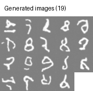
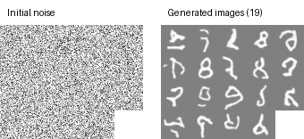
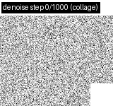

# Inference Report

## Summary
- Time (UTC): 2026-04-09T14:57:59.167047+00:00
- Model used: `C:\Users\nikda\Documents\DDPM\ddpm_project\results\run_20260409_170248\train\model-final.pt`
- Generated images: 19

## Output
- Folder: `output/`
- `digit_00.png`
- `digit_01.png`
- `digit_02.png`
- `digit_03.png`
- `digit_04.png`
- `digit_05.png`
- `digit_06.png`
- `digit_07.png`
- `digit_08.png`
- `digit_09.png`
- `digit_10.png`
- `digit_11.png`
- `digit_12.png`
- `digit_13.png`
- `digit_14.png`
- `digit_15.png`
- `digit_16.png`
- `digit_17.png`
- `digit_18.png`

## Visuals

