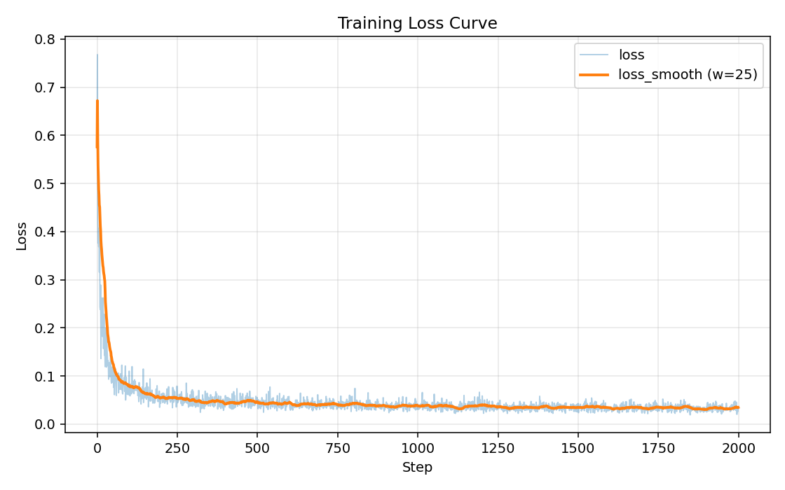
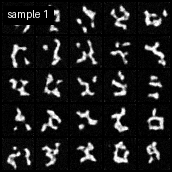

# Training Report

## Summary
- Status: Completed.
- Dataset: MNIST
- Image size: 32x32
- Steps reached: 1999
- Final loss: 0.033100

## Artifacts
- Model: `model-final.pt`
- Model checkpoints: `model_samples/`
- Training samples: `train_samples/`
- Metrics: `training_metrics.csv`
- Loss plot: `training_loss_curve.png`
- Samples GIF: `training_samples_progress.gif`

## Visuals

